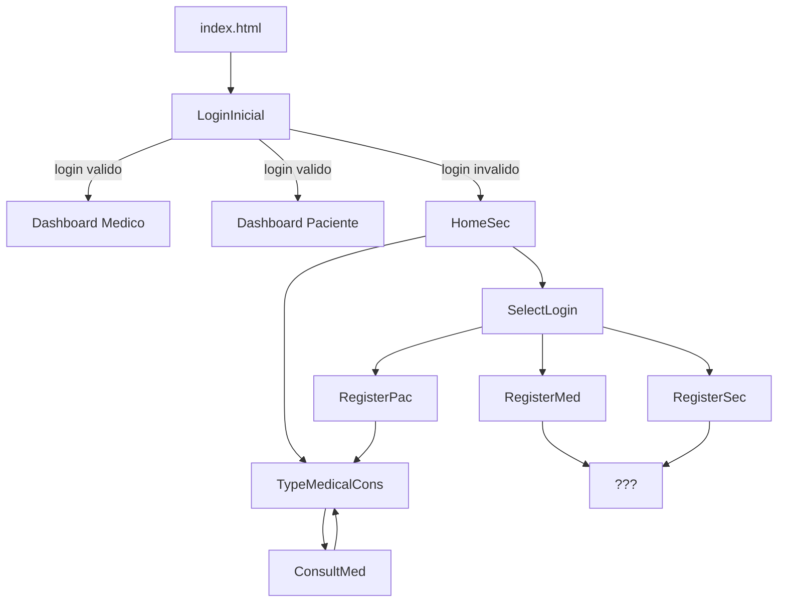
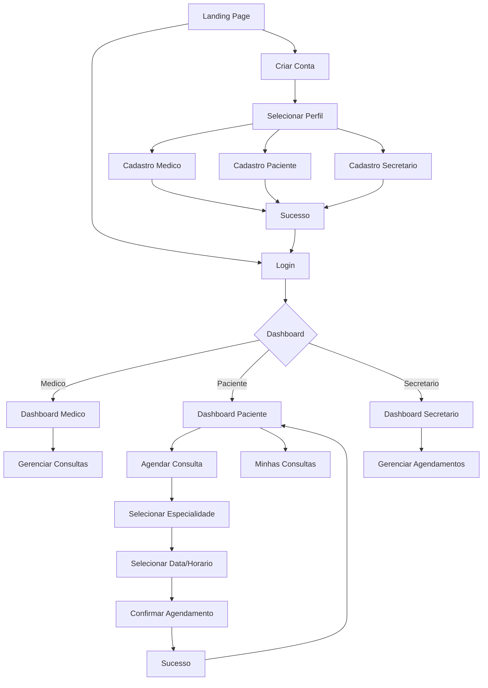
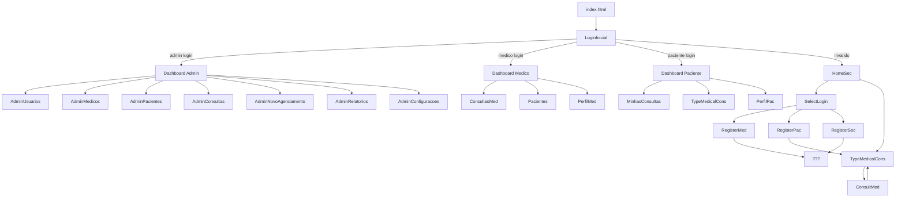

# 🏥 Sistema de Agendamento Médico — Plano de Melhorias UI/UX

## 1. Sumário Executivo

Este documento apresenta uma auditoria visual e de experiência do usuário (UI/UX) do sistema de agendamento médico, com um plano focado exclusivamente em **design, usabilidade, responsividade e acessibilidade**. Itens de segurança e backend serão tratados em fases futuras.

### Problemas de UI/UX Identificados

| # | Problema | Prioridade | Impacto |
|---|----------|------------|---------|
| 1 | Imagens usando caminho absoluto local | 🔴 Crítica | Portabilidade |
| 2 | Código CSS duplicado em 10+ arquivos | 🔴 Crítica | Manutenibilidade |
| 3 | Nenhuma responsividade implementada | 🔴 Crítica | Acessibilidade |
| 4 | Nenhum feedback visual de erro/sucesso | 🟠 Alta | UX |
| 5 | Fluxo de navegação confuso e quebrado | 🟠 Alta | UX |
| 6 | Design visual datado e inconsistente | 🟠 Alta | UI |
| 7 | Título da página DashboardPac truncado | 🟡 Média | Qualidade |
| 8 | Alt texts incorretos em imagens | 🟡 Média | Acessibilidade |
| 9 | Pastas vazias (components/, assert/) | 🟢 Baixa | Organização |

---

## 2. Análise Detalhada do Projeto Atual

### 2.1 Arquitetura Atual

```
testeFrontHtml/
├── index.html                    # Redireciona para LoginInicial
├── README.md                     # Instruções da auditoria
├── images/                       # Imagens estáticas
├── js/
│   ├── data.js                   # Camada de dados (MedCloud)
│   ├── app.js                    # Utilitários compartilhados
│   ├── email-service.js          # Serviço de e-mail (MedCloudEmail)
│   └── notification-worker.js    # Worker de notificações
├── styles/
│   ├── design-system.css         # Variáveis CSS e design tokens
│   ├── reset.css                 # Reset global
│   ├── components.css            # Componentes reutilizáveis
│   ├── animations.css            # Animações e keyframes
│   ├── admin.css                 # Estilos compartilhados do admin
│   └── dark-theme.css            # Modo escuro
├── pages/
│   ├── LoginInicial/             # Tela de login
│   ├── SelectLogin/              # Seleção de tipo de cadastro
│   ├── RegisterMed/              # Cadastro de médico
│   ├── RegisterPac/              # Cadastro de paciente
│   ├── RegisterSec/              # Cadastro de secretário
│   ├── HomeSec/                  # Home page (não logada)
│   ├── TypeMedicalCons/          # Seleção de especialidade
│   ├── ConsultMed/               # Formulário de agendamento
│   ├── NovaConsulta/             # Nova consulta (paciente logado)
│   ├── Dashboard/                # Painel do médico
│   ├── DashboardPac/             # Painel do paciente
│   ├── ConsultasMed/             # Consultas do médico
│   ├── Pacientes/                # Pacientes do médico
│   ├── PerfilMed/                # Perfil do médico
│   ├── MinhasConsultas/          # Consultas do paciente
│   ├── PerfilPac/                # Perfil do paciente
│   ├── DashboardAdmin/           # Painel do administrador
│   │   ├── DashboardAdmin.html   # Dashboard principal
│   │   ├── AdminUsuarios.html    # Gestão de usuários
│   │   ├── AdminMedicos.html     # Listagem de médicos
│   │   ├── AdminPacientes.html   # Listagem de pacientes
│   │   ├── AdminConsultas.html   # Gestão de consultas
│   │   ├── AdminNovoAgendamento.html # Novo agendamento
│   │   ├── AdminRelatorios.html  # Relatórios e estatísticas
│   │   └── AdminConfiguracoes.html # Configurações do sistema
│   ├── ConfigEmail/              # Configuração de e-mail
│   ├── EmailLog/                 # Histórico de e-mails
│   ├── EsqueciSenha/             # Recuperação de senha
│   ├── RedefinirSenha/           # Redefinição de senha
│   ├── NotFound/                 # Página 404
│   ├── Loading/                  # Tela de loading
│   └── Success/                  # Tela de sucesso
├── server/                       # Backend (Node.js)
├── tests/                        # Testes automatizados
├── components/                   # Vazio
└── assert/                       # Vazio
```

### 2.2 Fluxo de Navegação Atual



**Problemas de fluxo identificados:**
- Cadastro de médico (`RegisterMed`) não redireciona para lugar nenhum
- Cadastro de secretário (`RegisterSec`) não redireciona para lugar nenhum
- Botão "Agendar Consulta" dentro de `RegisterPac` leva para `TypeMedicalCons` — fluxo confuso
- Botão "Agendar Consulta" dentro de `ConsultMed` também leva para `TypeMedicalCons` — loop
- Não há tela de confirmação após agendamento
- Não há tela de "Esqueci minha senha"
- Não há página 404 ou de erro

### 2.3 Problemas de Design Visual

#### Paleta de Cores
- Uso inconsistente de `#aaecf2` (background), `#2c7a87` (teal escuro), `#e0e0e0` (inputs), `#ccc` (botões)
- Sem design system ou variáveis CSS
- Contraste insuficiente em botões cinza (`#ccc` em fundo branco)

#### Tipografia
- Apenas `Arial, sans-serif` em todo o projeto
- Sem hierarquia tipográfica (tamanhos, pesos, estilos)
- Sem importação de fontes modernas

#### Componentes
- Botões sem diferenciação visual entre ações primárias/secundárias
- Inputs sem labels, apenas placeholders
- Cards sem padding consistente
- Sem ícones ou elementos visuais modernos
- Sem sombras ou profundidade adequadas

#### Espaçamentos
- Inconsistentes entre páginas
- Padding de `30px` em algumas, `20px` em outras
- Sem sistema de espaçamento definido

### 2.4 Problemas de Responsividade

- **Nenhuma página é responsiva** — todas usam larguras fixas em pixels
- Layouts de duas colunas (LoginInicial, SelectLogin, Dashboards) quebram em telas menores
- Cards de especialidades (280px fixos) não se adaptam
- Formulários com largura fixa de 350px
- Nenhum arquivo CSS contém `@media` queries
- Sem viewport meta tags adequadas (apenas Dashboards têm)

### 2.5 Problemas de Acessibilidade

- **Sem `<label>`** em nenhum input do sistema — apenas `placeholder`
- **Alt texts incorretos**: [`TypeMedicalCons.html:30`](pages/TypeMedicalCons/TypeMedicalCons.html:30) tem `alt="Ortopedia"` em imagem de dermatologia
- **Contraste insuficiente**: Botões `#ccc` (rgb(204,204,204)) em fundo branco têm ratio de ~1.5:1
- **Sem atributos ARIA** em nenhum componente
- **Sem foco visível** (`:focus-visible`) em elementos interativos
- **Navegação por teclado** não foi considerada

### 2.6 Problemas de Código

#### CSS Duplicado
O seguinte bloco aparece em **todos os 10 arquivos CSS**:
```css
* {
    margin: 0;
    padding: 0;
    box-sizing: border-box;
    font-family: Arial, sans-serif;
}
```

#### Imagens com Caminho Absoluto
- [`LoginInicial.html:15`](pages/LoginInicial/LoginInicial.html:15): `C:\Users\User\OneDrive\...\image.png`
- [`SelectLogin.html:14`](pages/SelectLogin/SelectLogin.html:14): `C:\Users\User\OneDrive\...\image.png`

#### Título Truncado
- [`DashboardPac.html:7`](pages/DashboardPac/DashboardPac.html:7): `"Ola, paciente! acompanhe seu calendario de"` — frase cortada

---

## 3. Plano de Melhorias — Foco Exclusivo em UI/UX

### Fase 1 — Fundação Visual (Prioridade Crítica/Alta)

#### 1.1 Corrigir Caminhos de Imagens
**Arquivos**: [`LoginInicial.html:15`](pages/LoginInicial/LoginInicial.html:15), [`SelectLogin.html:14`](pages/SelectLogin/SelectLogin.html:14)
**Ação**: Trocar caminhos absolutos por relativos (`../../images/image.png`)

#### 1.2 Corrigir Título DashboardPac
**Arquivo**: [`DashboardPac.html:7`](pages/DashboardPac/DashboardPac.html:7)
**Ação**: Alterar para `"Meu Painel — Acompanhe suas Consultas"`

#### 1.3 Corrigir Alt Texts Incorretos
**Arquivo**: [`TypeMedicalCons.html`](pages/TypeMedicalCons/TypeMedicalCons.html)
**Ação**: Corrigir `alt="Ortopedia"` para `alt="Dermatologia"` e `alt="Cardiologia"` nos cards respectivos

#### 1.4 Criar Design System com Variáveis CSS
**Novo arquivo**: [`styles/design-system.css`](styles/design-system.css)
**Conteúdo**:
```css
:root {
  /* Cores */
  --color-primary: #0D9488;
  --color-primary-dark: #0F766E;
  --color-primary-light: #14B8A6;
  --color-secondary: #0284C7;
  --color-accent: #F59E0B;
  --color-bg: #F0FDFA;
  --color-surface: #FFFFFF;
  --color-text: #1E293B;
  --color-text-secondary: #64748B;
  --color-border: #E2E8F0;
  --color-success: #22C55E;
  --color-error: #EF4444;
  --color-warning: #F59E0B;

  /* Tipografia */
  --font-family: 'Inter', -apple-system, sans-serif;
  --font-size-xs: 0.75rem;
  --font-size-sm: 0.875rem;
  --font-size-base: 1rem;
  --font-size-lg: 1.125rem;
  --font-size-xl: 1.25rem;
  --font-size-2xl: 1.5rem;
  --font-size-3xl: 1.875rem;

  /* Espaçamentos */
  --spacing-xs: 0.25rem;
  --spacing-sm: 0.5rem;
  --spacing-md: 1rem;
  --spacing-lg: 1.5rem;
  --spacing-xl: 2rem;
  --spacing-2xl: 3rem;

  /* Bordas e Sombras */
  --radius-sm: 0.375rem;
  --radius-md: 0.5rem;
  --radius-lg: 0.75rem;
  --radius-xl: 1rem;
  --shadow-sm: 0 1px 2px rgba(0,0,0,0.05);
  --shadow-md: 0 4px 6px rgba(0,0,0,0.07);
  --shadow-lg: 0 10px 15px rgba(0,0,0,0.1);
  --shadow-xl: 0 20px 25px rgba(0,0,0,0.1);

  /* Transições */
  --transition-fast: 150ms ease;
  --transition-normal: 250ms ease;
  --transition-slow: 350ms ease;
}
```

#### 1.5 Criar Componentes CSS Reutilizáveis
**Novo arquivo**: [`styles/components.css`](styles/components.css)
**Componentes**:
- `.btn-primary` — Botão principal (teal)
- `.btn-secondary` — Botão secundário (outline)
- `.btn-ghost` — Botão sem fundo
- `.input-field` — Input padronizado com label
- `.card` — Card padrão com sombra
- `.container-page` — Container centralizado responsivo
- `.toast` — Notificação de feedback
- `.badge` — Tags de status

#### 1.6 Remover CSS Duplicado
**Ação**: Extrair reset global para [`styles/reset.css`](styles/reset.css) e importar em todas as páginas

---

### Fase 2 — Refatoração Visual de Todas as Telas (Prioridade Alta)

#### 2.1 Tela de Login — Redesign
**Arquivos**: [`pages/LoginInicial/LoginInicial.html`](pages/LoginInicial/LoginInicial.html), [`pages/LoginInicial/LoginInicial.css`](pages/LoginInicial/LoginInicial.css)

**Melhorias**:
- Layout moderno com imagem decorativa à esquerda
- Formulário centralizado à direita com padding adequado
- Inputs com labels visíveis (não apenas placeholder)
- Botão primário com cor de destaque e hover state
- Links "Esqueci minha senha" e "Cadastre-se" estilizados
- Validação visual com bordas verdes/vermelhas
- Responsivo: empilha em mobile

#### 2.2 Tela de Seleção de Cadastro — Redesign
**Arquivos**: [`pages/SelectLogin/SelectLogin.html`](pages/SelectLogin/SelectLogin.html), [`pages/SelectLogin/SelectLogin.css`](pages/SelectLogin/SelectLogin.css)

**Melhorias**:
- Cards de seleção visual com ícones para cada perfil (Médico/Paciente/Secretário)
- Em vez de dropdown, usar cards clicáveis com hover e seleção visual
- Layout responsivo com grid

#### 2.3 Telas de Cadastro — Redesign Unificado
**Arquivos**: [`RegisterMed`](pages/RegisterMed/), [`RegisterPac`](pages/RegisterPac/), [`RegisterSec`](pages/RegisterSec/)

**Melhorias**:
- Design consistente entre os 3 formulários
- Inputs com labels flutuantes ou superiores
- Validação visual inline (borda verde quando válido, vermelha quando inválido)
- Botão de submit com feedback de loading
- Mensagens de erro claras abaixo de cada campo
- Link para voltar ao login

#### 2.4 Home Page — Redesign
**Arquivos**: [`pages/HomeSec/HomeSec.html`](pages/HomeSec/HomeSec.html), [`pages/HomeSec/HomeSec.css`](pages/HomeSec/HomeSec.css)

**Melhorias**:
- Hero section com ilustração e chamada principal
- Dois cards grandes e visuais para "Criar Conta" e "Agendar Consulta"
- Ícones ilustrativos em cada card
- Footer simples com informações

#### 2.5 Seleção de Especialidade — Redesign
**Arquivos**: [`pages/TypeMedicalCons/TypeMedicalCons.html`](pages/TypeMedicalCons/TypeMedicalCons.html), [`pages/TypeMedicalCons/TypeMedicalCons.css`](pages/TypeMedicalCons/TypeMedicalCons.css)

**Melhorias**:
- Cards com ícones grandes representando cada especialidade
- Imagens com bordas arredondadas e sombra suave
- Efeito hover com elevação (já existe, mas melhorar)
- Grid responsivo (3 colunas desktop, 2 tablet, 1 mobile)
- Botão "Selecionar" com cor primária e hover state

#### 2.6 Formulário de Agendamento — Redesign
**Arquivos**: [`pages/ConsultMed/ConsultMed.html`](pages/ConsultMed/ConsultMed.html), [`pages/ConsultMed/ConsultMed.css`](pages/ConsultMed/ConsultMed.css)

**Melhorias**:
- Layout mais limpo e organizado
- Input de data com ícone de calendário
- Input de hora com ícone de relógio
- Validação visual em tempo real
- Botão "Agendar" com confirmação visual
- Tela de sucesso após agendamento (modal ou toast)

#### 2.7 Dashboard Médico — Redesign
**Arquivos**: [`pages/Dashboard/Dashboard.html`](pages/Dashboard/Dashboard.html), [`pages/Dashboard/Dashboard.css`](pages/Dashboard/Dashboard.css)

**Melhorias**:
- Sidebar com navegação (Home, Consultas, Pacientes, Perfil, Sair)
- Cards de estatísticas (Total consultas, Pendentes, Canceladas)
- Lista de consultas do dia com indicadores de status (cores)
- Design mais moderno com sombras e espaçamento adequado
- Responsivo: sidebar vira menu hamburger em mobile

#### 2.8 Dashboard Paciente — Redesign
**Arquivos**: [`pages/DashboardPac/DashboardPac.html`](pages/DashboardPac/DashboardPac.html), [`pages/DashboardPac/DashboardPac.css`](pages/DashboardPac/DashboardPac.css)

**Melhorias**:
- Sidebar com navegação (Home, Minhas Consultas, Agendar, Perfil)
- Lista de consultas agendadas com status visual
- Botão "Nova Consulta" em destaque
- Design consistente com o Dashboard médico

---

### Fase 3 — Responsividade e Acessibilidade (Prioridade Alta)

#### 3.1 Implementar Responsividade Completa

**Breakpoints**:
- Mobile: 320px — 480px
- Tablet: 481px — 768px
- Desktop: 769px+

**Ações por página**:

| Página | Mobile | Tablet | Desktop |
|--------|--------|--------|---------|
| LoginInicial | Empilhar colunas | Empilhar colunas | 2 colunas |
| SelectLogin | Cards empilhados | 2 colunas | 2 colunas |
| RegisterMed/Pac/Sec | Form 100% largura | Form centralizado | Form centralizado |
| HomeSec | Cards empilhados | 2 colunas | 2 colunas |
| TypeMedicalCons | 1 card por linha | 2 cards por linha | 3 cards por linha |
| ConsultMed | Form 100% | Form centralizado | Form centralizado |
| Dashboards | Sidebar oculta/hamburger | Sidebar compacta | Sidebar fixa |

#### 3.2 Melhorar Acessibilidade (WCAG 2.1 AA)

**Ações**:
- Adicionar `<label for="...">` em todos os inputs
- Adicionar `aria-label` em botões sem texto visível
- Garantir contraste mínimo de 4.5:1 em todos os textos
- Adicionar `:focus-visible` em todos os elementos interativos
- Adicionar `role="navigation"` em menus
- Usar `sr-only` class para conteúdo apenas para leitores de tela
- Corrigir todos os `alt` texts para serem descritivos

---

### Fase 4 — Novas Funcionalidades de UI (Prioridade Média)

#### 4.1 Modo Escuro
**Implementação**:
- Variáveis CSS para tema escuro (`[data-theme="dark"]`)
- Toggle button no header
- Persistência da preferência no `localStorage`

#### 4.2 Notificações Toast
**Implementação**:
- Componente de toast para feedback de ações
- Tipos: success (verde), error (vermelho), warning (amarelo), info (azul)
- Animação de entrada/saída
- Auto-dismiss após 3 segundos

#### 4.3 Animações e Microinterações
**Implementação**:
- Transições suaves em hover de cards e botões
- Loading skeleton para dashboards
- Animação de fade-in ao carregar páginas
- Feedback visual em cliques (ripple effect)

#### 4.4 Telas de Sistema
**Novas páginas**:
- [`pages/NotFound/`](pages/NotFound/) — Página 404 personalizada com ilustração
- [`pages/Loading/`](pages/Loading/) — Tela de loading com spinner/skeleton
- [`pages/Success/`](pages/Success/) — Confirmação de ação (cadastro, agendamento)

---

## 4. Fluxo de Navegação Otimizado



---

## 5. Lista Priorizada de Melhorias (Apenas UI/UX)

### 🔴 Críticas
| # | Melhoria | Arquivos | Esforço |
|---|----------|----------|---------|
| 1 | Corrigir caminhos absolutos de imagens | LoginInicial.html, SelectLogin.html | 🟢 Baixo |
| 2 | Criar Design System (variáveis CSS) | styles/design-system.css | 🟡 Médio |
| 3 | Criar componentes CSS reutilizáveis | styles/components.css | 🟡 Médio |
| 4 | Remover CSS duplicado | Todos os CSS | 🟡 Médio |
| 5 | Implementar responsividade | Todas as páginas | 🔴 Alto |

### 🟠 Alta
| # | Melhoria | Arquivos | Esforço |
|---|----------|----------|---------|
| 6 | Redesign tela de Login | LoginInicial/ | 🟡 Médio |
| 7 | Redesign seleção de cadastro | SelectLogin/ | 🟡 Médio |
| 8 | Redesign formulários de cadastro | RegisterMed, RegisterPac, RegisterSec | 🟡 Médio |
| 9 | Redesign Home page | HomeSec/ | 🟡 Médio |
| 10 | Redesign especialidades | TypeMedicalCons/ | 🟡 Médio |
| 11 | Redesign agendamento | ConsultMed/ | 🟡 Médio |
| 12 | Redesign Dashboards | Dashboard/, DashboardPac/ | 🔴 Alto |
| 13 | Melhorar acessibilidade | Todas as páginas | 🟡 Médio |

### 🟡 Média
| # | Melhoria | Arquivos | Esforço |
|---|----------|----------|---------|
| 14 | Modo escuro | styles/dark-theme.css | 🟡 Médio |
| 15 | Notificações toast | styles/components.css + js | 🟡 Médio |
| 16 | Animações e microinterações | styles/animations.css | 🟡 Médio |
| 17 | Página 404 | pages/NotFound/ | 🟢 Baixo |
| 18 | Tela de loading | pages/Loading/ | 🟢 Baixo |
| 19 | Tela de sucesso | pages/Success/ | 🟢 Baixo |

---

## 6. Arquivos a Serem Criados/Modificados

### Novos Arquivos
```
styles/
├── design-system.css       # Variáveis CSS e design tokens
├── reset.css               # Reset global
├── components.css          # Componentes reutilizáveis
├── utilities.css           # Classes utilitárias
├── animations.css          # Animações e keyframes
├── dark-theme.css          # Modo escuro

pages/
├── NotFound/
│   ├── NotFound.html
│   └── NotFound.css
├── Loading/
│   ├── Loading.html
│   └── Loading.css
├── Success/
│   ├── Success.html
│   └── Success.css
```

### Arquivos a Modificar
```
index.html
pages/LoginInicial/LoginInicial.html
pages/LoginInicial/LoginInicial.css
pages/SelectLogin/SelectLogin.html
pages/SelectLogin/SelectLogin.css
pages/RegisterMed/RegisterMed.html
pages/RegisterMed/RegisterMed.css
pages/RegisterPac/RegisterPac.html
pages/RegisterPac/RegisterPac.css
pages/RegisterSec/RegisterSec.html
pages/RegisterSec/RegisterSec.css
pages/HomeSec/HomeSec.html
pages/HomeSec/HomeSec.css
pages/TypeMedicalCons/TypeMedicalCons.html
pages/TypeMedicalCons/TypeMedicalCons.css
pages/ConsultMed/ConsultMed.html
pages/ConsultMed/ConsultMed.css
pages/Dashboard/Dashboard.html
pages/Dashboard/Dashboard.css
pages/DashboardPac/DashboardPac.html
pages/DashboardPac/DashboardPac.css
```

---

## 7. Tecnologias Sugeridas

| Tecnologia | Uso |
|------------|-----|
| CSS Custom Properties | Design system |
| CSS Grid + Flexbox | Layout responsivo |
| Google Fonts (Inter) | Tipografia moderna |
| Font Awesome / Phosphor Icons | Iconografia |
| Vanilla JavaScript | Interatividade (toasts, tabs, modais) |
| `prefers-color-scheme` | Modo escuro nativo |

---

## 8. Próximos Passos

1. **Aprovar este plano** com foco exclusivo em UI/UX
2. **Iniciar pela Fase 1** — Design system e correções críticas
3. **Refatorar página por página** seguindo a ordem do fluxo do usuário
4. **Implementar responsividade e acessibilidade** em paralelo
5. **Adicionar modo escuro e animações** como toque final

---

*Documento gerado em 23/06/2026 — Plano de melhorias UI/UX do sistema de agendamento médico.*

---

## 9. Implementações Realizadas — Sistema Administrativo

### 9.1 Resumo das Alterações

Com base nas necessidades identificadas, foram implementadas as seguintes funcionalidades:

| # | Funcionalidade | Status | Arquivos |
|---|---------------|--------|----------|
| 1 | Campo de e-mail na página "Nova Consulta" com validação | ✅ Completo | [`pages/NovaConsulta/NovaConsulta.html`](pages/NovaConsulta/NovaConsulta.html) |
| 2 | Envio automático de e-mail de confirmação de agendamento | ✅ Completo | [`js/email-service.js`](js/email-service.js) |
| 3 | Remoção de "Cadastrar Consulta" do Dashboard Médico | ✅ Completo | [`pages/Dashboard/Dashboard.html`](pages/Dashboard/Dashboard.html), [`pages/ConsultasMed/ConsultasMed.html`](pages/ConsultasMed/ConsultasMed.html), [`pages/Pacientes/Pacientes.html`](pages/Pacientes/Pacientes.html), [`pages/PerfilMed/PerfilMed.html`](pages/PerfilMed/PerfilMed.html) |
| 4 | Criação do perfil Administrador | ✅ Completo | [`js/data.js`](js/data.js), [`js/app.js`](js/app.js), [`pages/LoginInicial/LoginInicial.html`](pages/LoginInicial/LoginInicial.html) |
| 5 | Dashboard Administrativo | ✅ Completo | [`pages/DashboardAdmin/DashboardAdmin.html`](pages/DashboardAdmin/DashboardAdmin.html) |
| 6 | Gestão de Usuários (Médicos/Pacientes) | ✅ Completo | [`pages/DashboardAdmin/AdminUsuarios.html`](pages/DashboardAdmin/AdminUsuarios.html) |
| 7 | Listagem de Médicos | ✅ Completo | [`pages/DashboardAdmin/AdminMedicos.html`](pages/DashboardAdmin/AdminMedicos.html) |
| 8 | Listagem de Pacientes | ✅ Completo | [`pages/DashboardAdmin/AdminPacientes.html`](pages/DashboardAdmin/AdminPacientes.html) |
| 9 | Gestão de Consultas | ✅ Completo | [`pages/DashboardAdmin/AdminConsultas.html`](pages/DashboardAdmin/AdminConsultas.html) |
| 10 | Novo Agendamento (Admin) | ✅ Completo | [`pages/DashboardAdmin/AdminNovoAgendamento.html`](pages/DashboardAdmin/AdminNovoAgendamento.html) |
| 11 | Relatórios e Estatísticas | ✅ Completo | [`pages/DashboardAdmin/AdminRelatorios.html`](pages/DashboardAdmin/AdminRelatorios.html) |
| 12 | Configurações do Sistema | ✅ Completo | [`pages/DashboardAdmin/AdminConfiguracoes.html`](pages/DashboardAdmin/AdminConfiguracoes.html) |

### 9.2 Detalhamento das Implementações

#### 9.2.1 Campo de E-mail na "Nova Consulta"

- Adicionado campo obrigatório `<input type="email" id="emailConfirmacao">` no formulário de agendamento
- Valor pré-preenchido: `heloizacustodio089@gmail.com`
- Validação com regex de e-mail antes do envio
- Após criar a consulta, envia e-mail de confirmação usando `MedCloudEmail.buildAppointmentConfirmationEmail()` e `MedCloudEmail.sendEmail()`

#### 9.2.2 Template de E-mail de Confirmação

- Função [`buildAppointmentConfirmationEmail()`](js/email-service.js:423) em [`js/email-service.js`](js/email-service.js)
- Gera HTML com: nome do paciente, nome do médico, especialidade, data, horário e protocolo
- Exportada na API pública do módulo `MedCloudEmail`

#### 9.2.3 Perfil Administrador

**Credenciais padrão:**
- E-mail: `admin@medcloud.com`
- Senha: `admin123`

**Alterações no [`js/data.js`](js/data.js):**
- Adicionado array `administradores` com admin padrão
- [`login()`](js/data.js:246) verifica administradores primeiro
- Métodos: [`isAdmin()`](js/data.js:291), [`getAdministradores()`](js/data.js:296), [`getStatsAdmin()`](js/data.js:512), [`criarMedico()`](js/data.js:528), [`criarPaciente()`](js/data.js:545), [`desativarMedico()`](js/data.js:561), [`desativarPaciente()`](js/data.js:571)

**Alterações no [`js/app.js`](js/app.js):**
- [`requireAuth()`](js/app.js:29) redireciona admin para `../DashboardAdmin/DashboardAdmin.html`

**Alterações no [`pages/LoginInicial/LoginInicial.html`](pages/LoginInicial/LoginInicial.html):**
- Botão "Admin" nos accounts demo: `fillDemo('admin@medcloud.com', 'admin123')`
- Login redirect verifica `tipo === 'admin'`

#### 9.2.4 Dashboard Administrativo

**Páginas criadas em [`pages/DashboardAdmin/`](pages/DashboardAdmin/):**

| Página | Funcionalidade |
|--------|---------------|
| [`DashboardAdmin.html`](pages/DashboardAdmin/DashboardAdmin.html) | Stats cards (Médicos, Pacientes, Consultas Hoje, Total), gráficos Chart.js (Consultas por Mês, Status, Especialidade), ações rápidas, consultas recentes |
| [`AdminUsuarios.html`](pages/DashboardAdmin/AdminUsuarios.html) | Filtros (Todos/Médicos/Pacientes), busca, tabela com editar/desativar, modais de criação/edição |
| [`AdminMedicos.html`](pages/DashboardAdmin/AdminMedicos.html) | Listagem com busca, tabela (nome, CRM, especialidade, email, telefone, consultas) |
| [`AdminPacientes.html`](pages/DashboardAdmin/AdminPacientes.html) | Listagem com busca, tabela (nome, CPF, email, telefone, consultas) |
| [`AdminConsultas.html`](pages/DashboardAdmin/AdminConsultas.html) | Filtros (Todas/Futuras/Concluídas/Canceladas), busca, ações de concluir/cancelar |
| [`AdminNovoAgendamento.html`](pages/DashboardAdmin/AdminNovoAgendamento.html) | Formulário completo: paciente (select), médico (select com auto-fill especialidade), data, hora, e-mail confirmação, observações, verificação de conflitos, envio de e-mail |
| [`AdminRelatorios.html`](pages/DashboardAdmin/AdminRelatorios.html) | Filtro por período (mês/trimestre/ano/total), stats resumo, gráficos (Chart.js), tabela de desempenho por médico com barra de taxa de sucesso, tabela de atividade de pacientes, exportação CSV |
| [`AdminConfiguracoes.html`](pages/DashboardAdmin/AdminConfiguracoes.html) | Notificações (toggle switches), configuração de e-mail (provedor, e-mail padrão, teste), dados do admin, informações do sistema, exportar/resetar dados, histórico de e-mails |

#### 9.2.5 Navegação do Admin

```
Sidebar: Dashboard → Usuários → Médicos → Pacientes → Consultas → Novo Agendamento → Relatórios → Configurações → Sair
```

Todas as páginas admin compartilham:
- Sidebar consistente com link ativo destacado
- Topbar com saudação, toggle tema, avatar
- Overlay para mobile sidebar
- Toast container para feedback
- `requireAuth('admin')` como guarda de autenticação

### 9.3 Fluxo de Navegação Atualizado



### 9.4 Próximos Passos Recomendados

1. **🔴 Crítica**: Implementar responsividade completa em todas as páginas admin
2. **🟠 Alta**: Adicionar paginação nas tabelas de usuários, médicos, pacientes e consultas
3. **🟠 Alta**: Implementar notificações em tempo real para novos agendamentos
4. **🟡 Média**: Adicionar gráfico de faturamento/renda nos relatórios
5. **🟡 Média**: Implementar exportação PDF nos relatórios
6. **🟢 Baixa**: Adicionar upload de avatar/foto para médicos e pacientes
7. **🟢 Baixa**: Criar página de log de auditoria (ações dos administradores)
